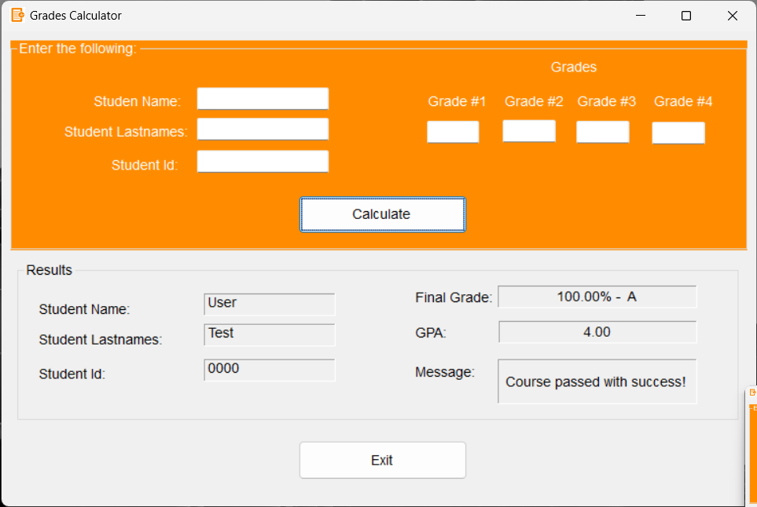
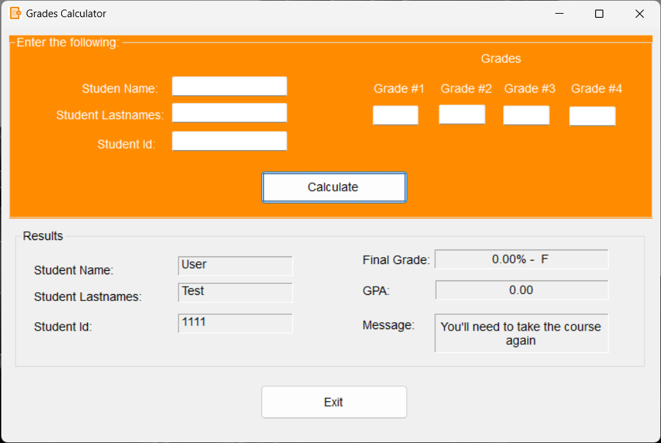

### This project is developed using Visual Basic and is a simple grade calculator that takes in four grades and returns the final grade, GPA, and a message indicating whether or not the student passed the course.

